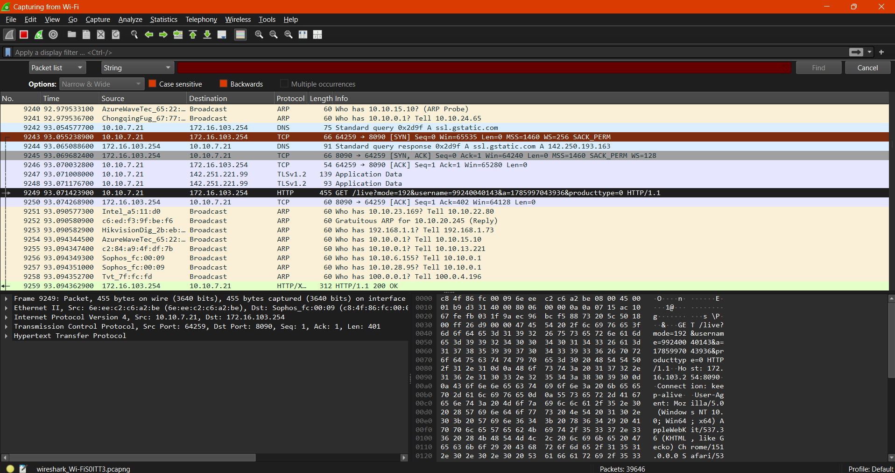
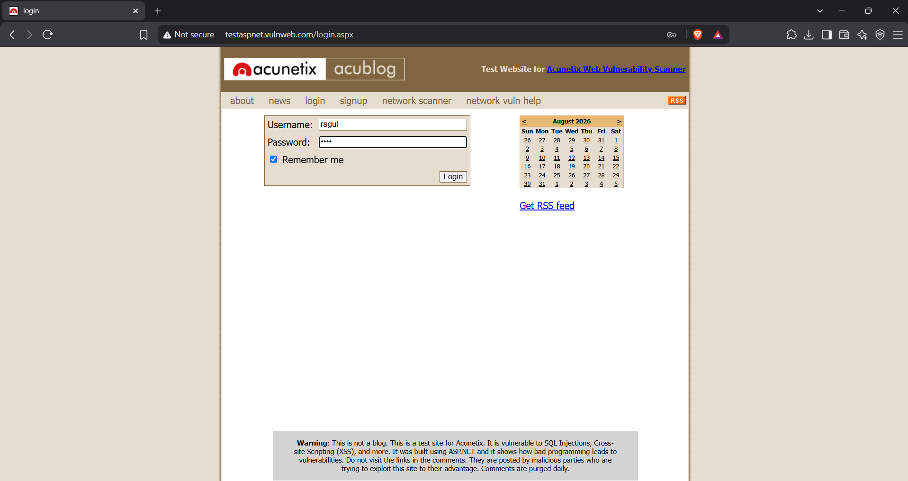
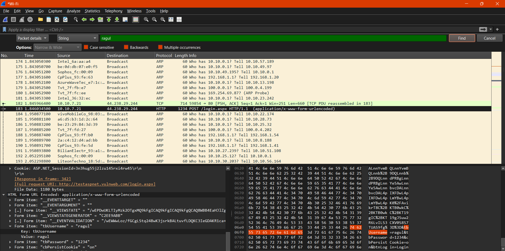
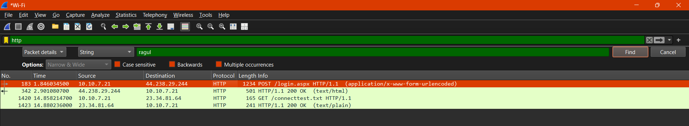
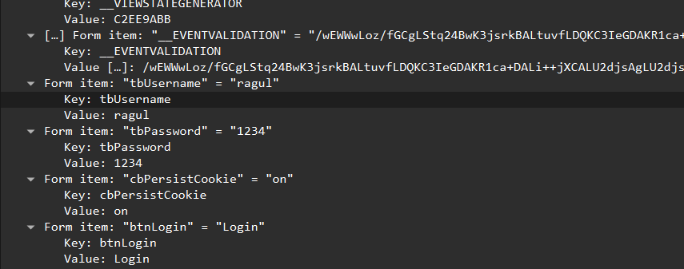

# Experiment 3: Password Capturing Using Wireshark

## Overview
Wireshark can capture not only passwords but any type of information transmitted over the network: usernames, email addresses, personal information, etc. As long as we can capture network traffic, Wireshark can sniff passing passwords. 

This sniffing can include passwords for various protocols such as HTTP, FTP, Telnet, etc. The captured data can be used to troubleshoot network problems, but can also be used maliciously to gain unauthorized access to sensitive information. 

Here we will see how we can capture a password using the Wireshark network capture analyzer and observe the outputs of the following steps.

---

## Procedure & Steps

### Step 1: Start Capturing the Network
First of all, open your Wireshark tool in your Windows or Linux virtual machine and start capturing the network. Suppose I am capturing my wireless fidelity (Wi-Fi).



### Step 2: Login to the Target Website
After starting the packet capturing, we will go to the website and log in with our credentials on that website, as you can see in the image below.



### Step 3: Prepare to Filter Traffic
Now, after completing the login process, we will go back to Wireshark to capture the password. To do this, we need to use filters that help find the specific login credentials among all the captured packets.

### Step 4: Filter HTTP Packets
Wireshark has captured many packets, but we are specifically looking for HTTP packets. In the display filter bar (the green bar), we apply the following filter command to find all captured HTTP packets:
```text
http
```



### Step 5: Understanding Form Data Submission Methods
There are some HTTP packets captured, but we are specifically looking for **form data** that the user submitted to the website. 

As we know, there are two main methods used for submitting form data from web pages (like login forms) to the server:
1. **GET**
2. **POST**

### Step 6: Checking for GET Method
Firstly, to find the credentials, we test the first method and apply the filter for GET requests:
```text
http.request.method == "GET"
```
*Note: If you look at the capture, there might be packets where the login page was requested with a GET request, but typically there is no form data submitted with it.*

### Step 7: Filtering for POST Method and Extracting Credentials
If we didn’t find the form data using GET, we try the POST method. We apply the following filter on Wireshark:
```text
http.request.method == "POST"
```
Alternatively, you can use the string search option (Ctrl + F) and search for the username you submitted (e.g., `ragul`).



As you can see, we have a packet with form data. Click on the packet showing the `POST /login.aspx` request. 

In the bottom pane, expand the **HTML Form URL Encoded: application/x-www-form-urlencoded** section. Here is where the login credentials are found, exactly as we filled them on the website in Step 2!



#### 🔑 Captured Credentials:
* **Form item: "tbUsername"** = `"ragul"`
* **Form item: "tbPassword"** = `"1234"`
